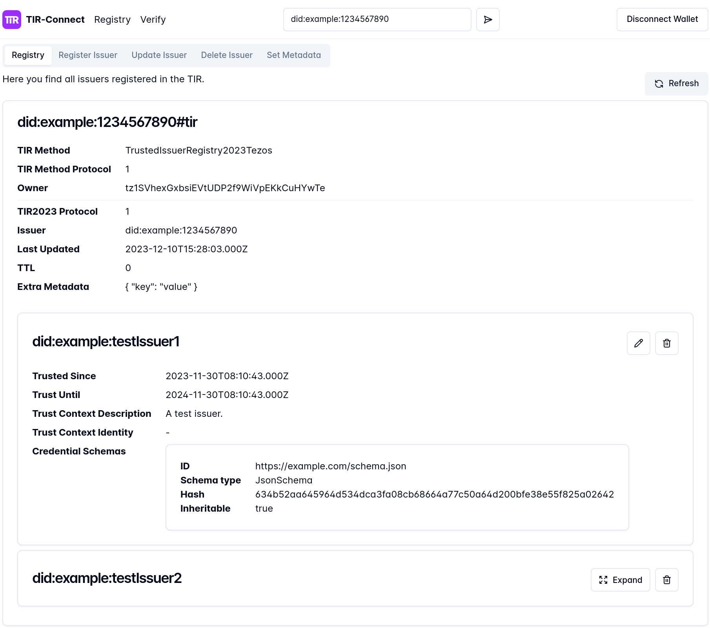

# Trusted Issuer Registry 2023 - Bachelor's Thesis Prototype Implementation

This repository is a monorepository containing a Vue Frontend, an Express Backend, a core package with shared logic for resolving Trusted Issuer Registries (TIR) and verifying issuers given a resolved TIR, and a Tezos smart contract. All subfolders have their own README.

The code is part of the 2023 bachelor's thesis "Design and Implementation of a Decentralized Trusted Issuer Registry for Self-Sovereign Identity" by Michael Schmidmaier ([PDF](https://wwwmatthes.in.tum.de/pages/dss6cww4npqp/Bachelor-s-Thesis-Michael-Schmidmaier)).

## Deployment with Docker Compose

Docker compose is setup to run the Vue frontend with an nginx server, the Express backend and a Redis database as a whole.

**Don't forget to first create appropriate .env files for frontend and backend (.env for frontend, .env.docker for backend).**

`docker compose up`

After the build is finished, you can access the frontend at [http://localhost:8080/](http://localhost:8080/).

To rebuild once after changes were made, run:

`docker compose up --build`

## Development

For developing, use the following instructions so that changes are automatically applied.

### TIR Core

Install all dependencies, in ./tir-core: `npm i`

Build and update frontend's and backend's dependency, in repository root:

`sh ./updateTirCore.sh`

After building, you may need to reload your IDE or language server to remove errors like "Cannot find module 'tir-core' or its corresponding type declarations.".

### Redis

In repository root: `docker compose up --build redis`

### Backend

In "backend/": `npm run dev`

### Frontend

In "frontend/": `npm run dev`

### OpenAPI Code Generation

The API and the shared data models are specified using an OpenAPI 3.1 schema: [tir-verifier-api.yaml](./tir-verifier-api.yaml)

To generate the API client for the frontend and models for backend and tir-core, you can execute [this script](./generateApi.sh) in the repository root:

`sh ./generateApi.sh`

## Frontend Screenshots

From left to right, top to bottom: TIR Management, Tezos TIR Issuer Registration, Issuer Verification with Trust Path Visualization

  
  
  

## License

This repository is licensed under the [MIT license](./LICENSE).
